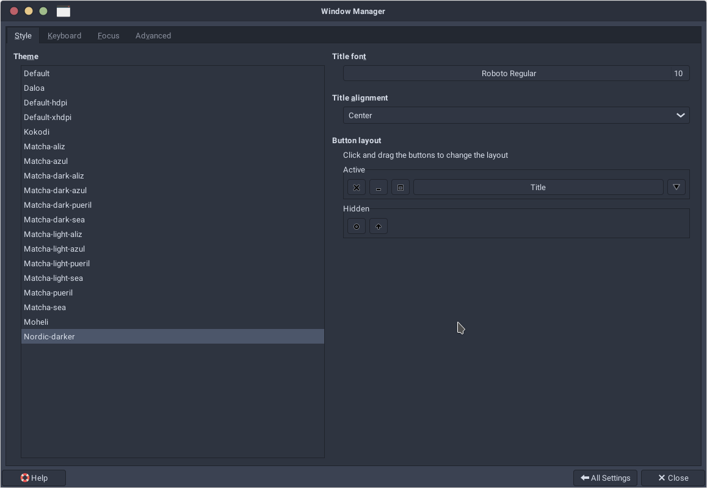
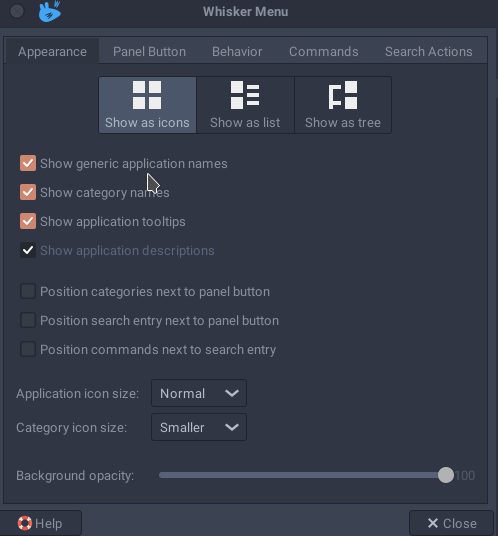
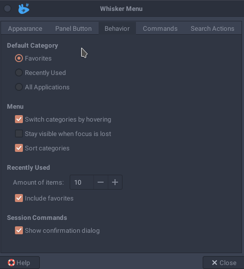
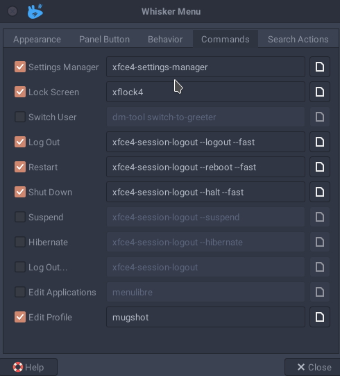

# Manjaro XFCE setup 🚀

Script to quicly setup new install of Manjaro Linux XFCE version. Personalised for my needs and files, but easy to customize for your needs ✨.

### Setup script and steps 🚛

```bash
bash -c "`curl -L https://raw.githubusercontent.com/fhavrlent/manjaro-xfce-setup/main/manjaro-xfce.sh`"
```

1. Install pswd manager to get passwords to use later
2. Edit `/etc/lightdm/lightdm.conf`

```
greeter-session=lightdm-webkit2-greeter
display-setup-script=xrandr --output DP-0 --primary
greeter-setup-script=/usr/bin/numlockx on
```
2. Set `Nordic` Theme (Appearance and Windows Manager)
3. Set `Flatery Blue Dark` icons
4. Set Window button layout
   
5. Set `Roboto Regular` as Default font and `Roboto Mono Light` as Default Monospace font
6. Windows Manager Tweaks -> Untick Show shadows under dock windows
7. Add Plank, ULauncher, Discord into startup
8. Set VPN client to start at startup
9.  Set `mcOS-BS-iMacM1-DarkBlue` in Plank
10. Set `Nord` theme in Tilix
11. Set Tilix -> Quake -> Hide toolbar
12. Keyboard settings -> Shortcuts -> F12 `tilix --quake`
13. Turn on Firefall
14. Sync VS Code setting
15. Add en-US keyboard
16. Set Whisker menu
    
    
17. Update kernel and language packages
18. Reboot and hope for the best 